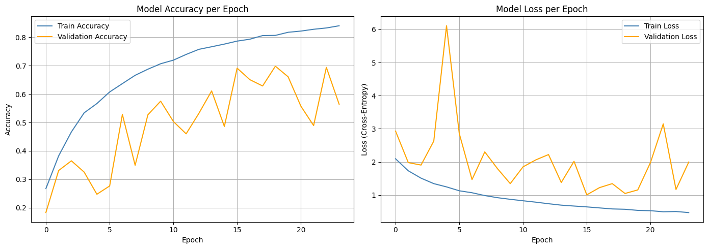
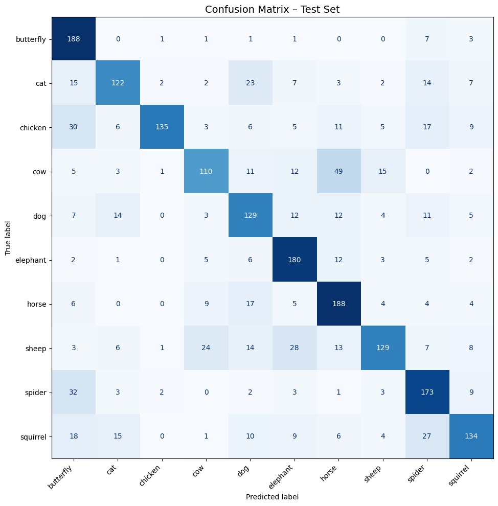
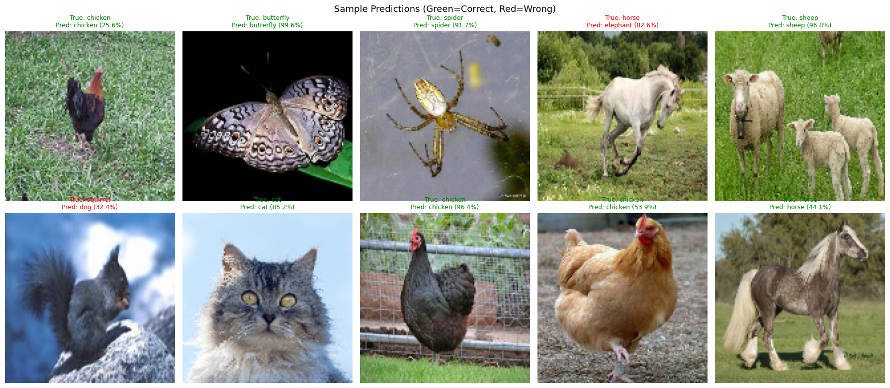

# Animal Image Classification with CNN

A convolutional neural network for classifying images across 10 animal categories using TensorFlow/Keras.

## Overview

This project investigates the use of convolutional neural networks for multi-class image classification.

The model was trained on the Animals-10 dataset using image preprocessing, data augmentation, Batch Normalization, dropout regularization, and early stopping.

### Results

* **Task:** 10-class animal image classification
* **Input:** 128 × 128 images
* **Framework:** TensorFlow / Keras
* **Training:** Google Colab
* **Validation Accuracy:** 76%
* **Evaluation:** Accuracy, precision, recall, F1-score, and confusion matrix

> The reported 76% result refers to validation performance. Test-set performance is reported separately in the evaluation output.

## Model Architecture

The CNN consists of three convolutional blocks followed by global average pooling and fully connected classification layers.

```text
Input (128 × 128)
        ↓
Random Flip / Rotation / Zoom
        ↓
Conv2D (32) + BatchNorm + MaxPooling
        ↓
Conv2D (64) + BatchNorm + MaxPooling
        ↓
Conv2D (128) + BatchNorm + MaxPooling
        ↓
Global Average Pooling
        ↓
Dense (128, ReLU)
        ↓
Dropout
        ↓
Dense (10, Softmax)
```

## Training

The model was trained using:

* Adam optimizer
* Learning rate: 0.001
* Sparse categorical cross-entropy
* Batch size: 32
* Maximum 30 epochs
* Early stopping based on validation loss
* Patience: 8 epochs

Data augmentation was applied during training using:

* Random horizontal flips
* Random rotations
* Random zoom

## Evaluation

The model was evaluated on a separate test set that was not used during training.

Evaluation includes:

* Overall test accuracy
* Confusion matrix
* Precision
* Recall
* F1-score
* Individual prediction examples with confidence scores

## Results

### Training Curves



### Confusion Matrix



### Sample Predictions



## Project Structure

```text
animal-image-classification/
├── README.md
├── src/
│   ├── prepare_data.py
│   ├── train.py
│   └── evaluate.py
├── notebooks/
│   └── animal_cnn.ipynb
├── results/
│   ├── training_curves.png
│   ├── confusion_matrix.png
│   └── sample_predictions.png
├── requirements.txt
├── .gitignore
└── LICENSE
```

## Dataset

This project uses the Animals-10 image classification dataset.

The dataset itself is not included in this repository.

After downloading the dataset, follow the preprocessing instructions in `src/prepare_data.py`.

## Technologies

* Python
* TensorFlow
* Keras
* NumPy
* Matplotlib
* scikit-learn
* Google Colab
* Jupyter Notebook

## What I Learned

Through this project I gained practical experience with:

* Convolutional neural networks
* Image preprocessing
* Data augmentation
* Batch Normalization
* Dropout regularization
* Model training and validation
* Overfitting analysis
* Classification metrics
* Confusion matrices
* Experimental evaluation

## Future Improvements

Possible improvements include:

* Transfer learning using pretrained architectures
* Comparing RGB and grayscale inputs
* Hyperparameter tuning
* More systematic data augmentation experiments
* Evaluating additional model architectures
* Deploying the trained model for inference
